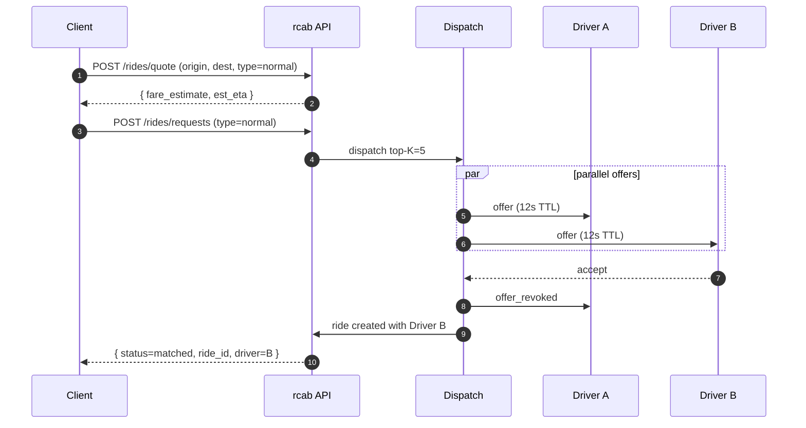

# Client books a normal ride

## After match — live tracking (RCAB-E4.S7)

Once `status=matched`, the client is already in the `ride:<id>` room (joined at request time, re-asserted via `ride:subscribe` on reconnect). It then follows the ride live: `ride_state_changed` drives the status banner (driver assigned → en route → arrived → on trip → complete) and `driver_location` moves the driver marker on the booking map (≤ 1 Hz). The driver's first location implicitly advances `accepted → en_route`. See [[websocket-events]] · [[sm-ride-lifecycle]].

## Failure paths

- No driver in K=5 accepts within 30s → wave 2 fires K=10.
- Total elapsed 60s without acceptance → request fails with `dispatch_no_driver`. Client is shown the option to try again, schedule, or convert to shared.
- Client cancels mid-flow → all outstanding offers revoked, request marked `canceled_by_client`.
- **Cancellation & no-show (RCAB-E4.S8):** the rider can tap **Cancel ride** any time before the trip starts (`POST /v1/rides/:id/cancel`); the ride goes `cancelled`, the driver is freed, and dispatch unwinds (claim/offers/timers via `RIDE_CANCELLED_EVENT`). Once `in_progress` the rider can no longer cancel (the trip ends via the driver). If the rider never shows, the driver can **Report no-show** from `arrived` after a 5-min wait → `no_show`. **Cancellation is free in Phase-0** — the fee mechanism is deferred to a later phase.

## See also
- [[features-normal-booking]] · [[algo-top-k-dispatch]]
- [[sm-booking-flow]] · [[sm-ride-lifecycle]]
- [[module-dispatch]]
