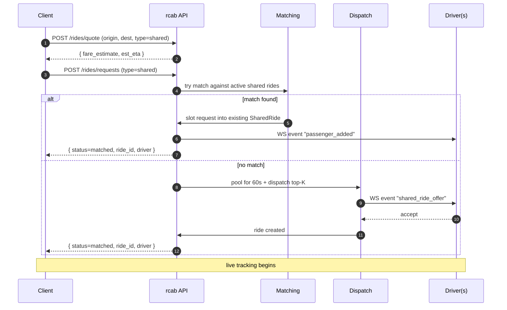

# Client books a shared ride

## Detail: pool window

During the 60-second pool window:

- Other matching shared requests can be added to the same pool (max 3).
- The dispatch is sent with the pool's *current* origin/destination span. As the pool grows, the offer to drivers updates.
- If no driver accepts and a 2nd request joins, the pool resets its dispatch timer once.
- If the pool ends with one rider and no driver, the request falls back to a normal booking (with the client's earlier consent at booking time).

## Detail: client UI states (RCAB-E5.S6)

The Next.js `/book` page (`apps/web/src/app/book/book-client.tsx`) holds the booking flow in a `useBookingStore` Zustand store. Stages:

| Stage | Trigger | UI |
|---|---|---|
| `idle` | initial load / ride type or trip change | preset trip picker + ride-type toggle (default `Share`) |
| `quoting` → `quoted` | preset/type change → `POST /v1/rides/quote` | "Pricing…" → fare card. For `Share`, shows indicative per-seat (2-seat pool) + solo fare. For `Private`, shows solo fare and a disabled "ships with E4" submit button. |
| `requesting` → `opened` / `slotted` | submit → `POST /v1/rides` (shared only) | spinner → pool card with `sharedRideId`, seat count, `poolStatus` |
| `applyPoolUpdate` | WS `pool:update` event on room `pool:<id>` | `seatCount > 1` shows `PoolBadge`; `closed_timeout` + `seatCount=1` flips stage to `solo_fallback` with `SoloFallbackBanner` |

Server-side, `RealtimeGateway.joinPool(userId, rideId)` puts the requesting client's socket into `pool:<rideId>` so the targeted emit reaches only that pool's members.

## See also
- [[features-shared-rides]] · [[algo-shared-ride-matching]] · [[algo-route-similarity]]
- [[sm-shared-ride-pool]] · [[module-matching]]
- [[entity-shared-ride]] · [[entity-ride-request]]
