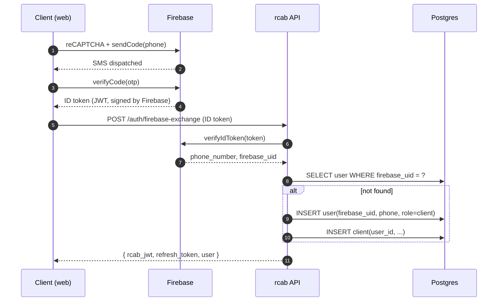

# Client OTP signup

*First-time login via phone number + OTP, powered by Firebase Phone Auth.*

## Happy path

## Edge cases

- **OTP rate-limit** — Firebase enforces. Surface a clear "try again in N s" message.
- **Wrong phone format** — client-side validation; server still revalidates.
- **Existing account with same phone** — exchange returns existing user (no duplicate created).
- **Network drop after Firebase verify, before our exchange** — the client retains the Firebase ID token (in memory only, never persisted) and retries with exponential backoff. If the token expires (1 h), restart the flow.

## Security notes

- We never store the Firebase ID token. We exchange it once and issue our own short-lived JWT + refresh token.
- The `firebase_uid` is the immutable link. The phone number can change later (port).
- Re-issued JWTs include `auth_method=phone|google` so frontends can prompt re-auth for sensitive actions.

## See also
- [[integration-firebase-phone-auth]] · [[module-auth]]
- [[journey-client-google-link]]
- [[entity-user]] · [[entity-client]]
