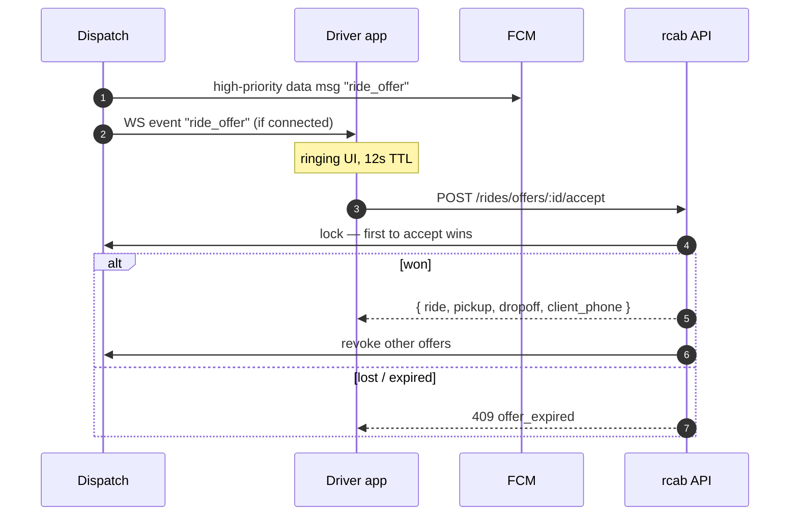

# Driver accepts a ride

## Why both FCM and WebSocket

WebSocket is the happy path when the app is in foreground / recently active. FCM data messages cover the case where the WS has gone stale (background, doze, weak network). The two are idempotent on the driver app — whichever arrives first opens the offer screen.

## After accept

- Driver app shows pickup card with a **"Navigate"** button → opens Google Maps deeplink ([[driver-google-maps-handoff]]).
- Driver app stays foreground via the location service. Ride moves to `accepted → en_route_pickup` in [[sm-ride-lifecycle]].

## See also
- [[algo-top-k-dispatch]] · [[sm-ride-lifecycle]]
- [[driver-google-maps-handoff]] · [[integration-fcm]]
- [[module-realtime]] · [[module-dispatch]]
