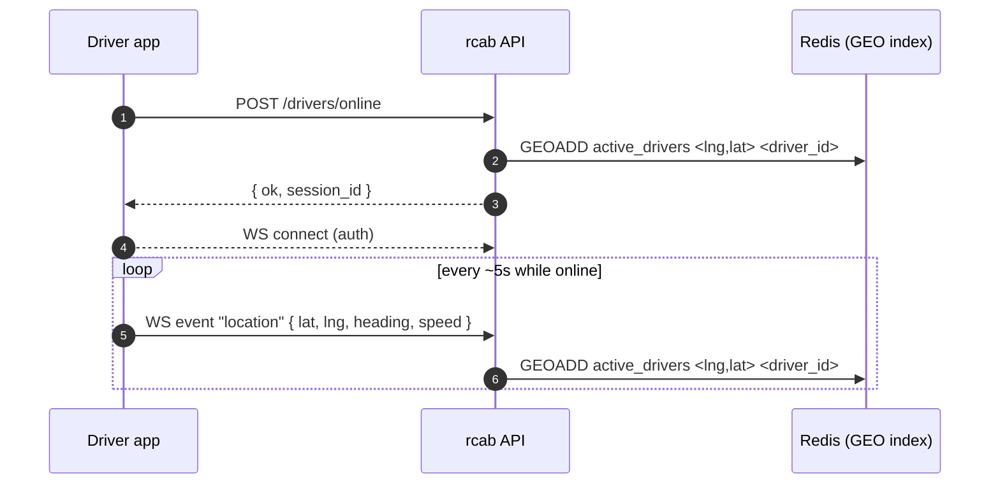

# Driver goes online

## Background behavior

The Flutter app declares a foreground service while online so Android does not kill the location stream. See [[driver-background-location]] for OS-specific handling.

## Going offline

- Manual toggle → `POST /drivers/offline` + WS disconnect.
- Auto-offline if no location update for 60s → server `ZREM` from the geo index. App is told via WS or, if disconnected, via FCM.

## See also
- [[sm-driver-availability]] · [[driver-background-location]]
- [[redis-usage]] · [[module-realtime]]
