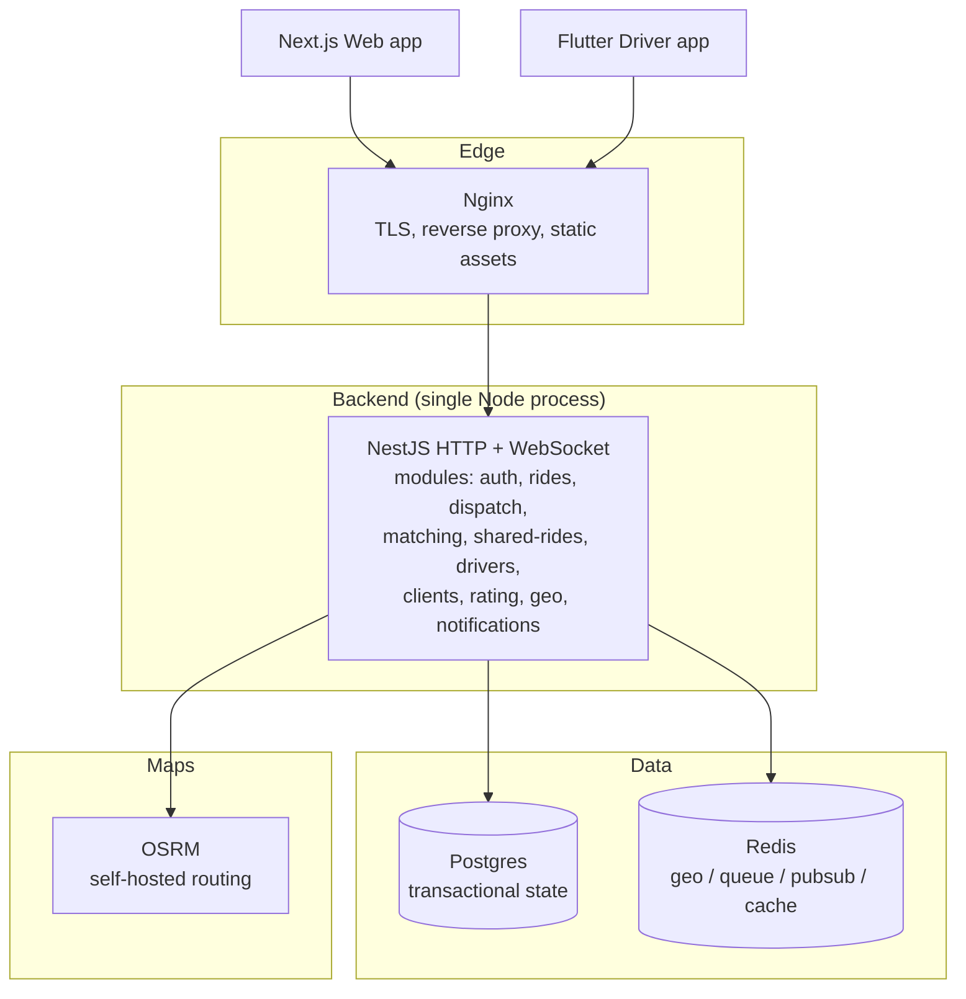

# C4 — Containers

*Inside the rcab platform — one level deeper.*

## Container responsibilities

| Container | Responsibility | Tech |
|---|---|---|
| **Nginx** | TLS termination, static file serving for the Next.js build, reverse proxy to API. | nginx + certbot |
| **NestJS API** | HTTP REST + Socket.IO. Houses all business logic in modules. Single process for Phase-0. | Node 20, NestJS 10 |
| **Postgres** | Transactional state — users, drivers, vehicles, rides, ride requests, ratings. | Postgres 16 |
| **Redis** | Driver geo index (`GEOADD`), dispatch offer locks, BullMQ scheduled jobs, pub/sub for Socket.IO across future replicas. | Redis 7 |
| **OSRM** | Route + ETA computation for booking quotes and shared-ride detour checks. | OSRM backend (pre-built India PBF) |
| **Next.js web** | Client booking PWA, OSM map, Firebase Phone Auth, Google sign-in. | Next.js 14, TS |
| **Flutter app** | Driver app — go online, accept, location streaming, Google Maps handoff, FCM push. | Flutter 3.x |

## Notes on the deliberate single-process design

- NestJS modules ([[module-map]]) are firewalled with strict dependency direction; future split is mechanical.
- Socket.IO uses Redis adapter from day one even though we have one node — so scaling out doesn't break the contract. See [[module-realtime]].

## See also
- [[c4-context]] · [[deployment-topology]] · [[module-map]]
- [[nestjs-structure]] · [[service-boundaries]]
