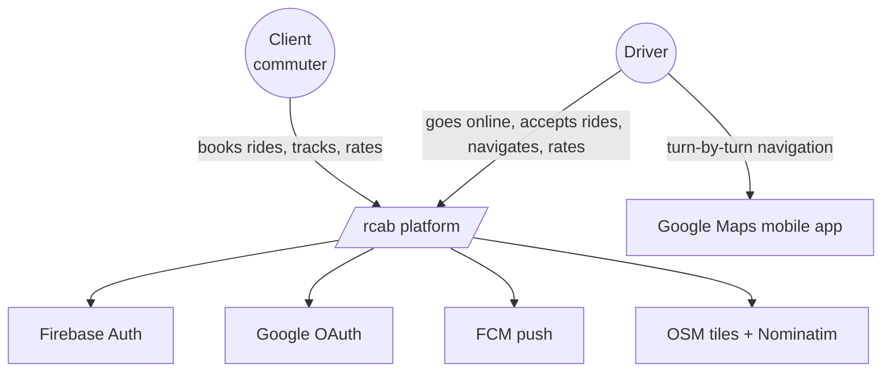

# C4 — System context

*The system as a black box surrounded by its users and external services.*

## Actors & systems

| Actor / System | Role |
|---|---|
| Client (commuter) | Books normal / shared / scheduled rides. |
| Driver | Accepts and completes rides. |
| Firebase Auth | Phone OTP verification + Google ID-token issuance. |
| Google OAuth | (Indirectly via Firebase) account-link identity. |
| FCM | Push delivery to driver devices. |
| OpenStreetMap ecosystem | Tiles, geocoding (Nominatim), routing (OSRM, internal). |
| Google Maps (app) | Driver-side turn-by-turn — invoked via deep link. |

## See also
- [[c4-containers]] · [[system-overview]]
