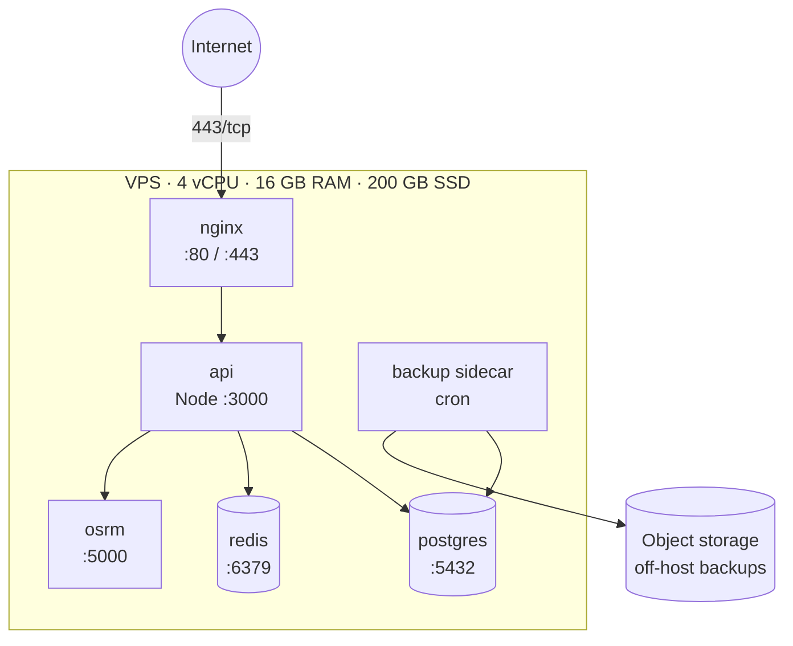

# Deployment topology (Phase-0)

*Single VPS, docker-compose, nginx + Let's Encrypt out front.*

## Networking

- All containers on a private `rcab_net` docker network.
- Only nginx is published on host `:80, :443`.
- API binds `127.0.0.1:3000`; nginx upstreams to it via the docker network.
- Postgres + Redis never bind to a public interface.

## DNS

- `api.rcab.example` → VPS public IP. Cert via certbot HTTP-01.
- `app.rcab.example` → same VPS — Nginx serves the Next.js export.
- `osrm.rcab.example` → not public; accessed only over the docker network.

## Resource sizing (rule-of-thumb at 5k users / 100 drivers)

| Container | CPU | RAM | Notes |
|---|---|---|---|
| api | 2 cores | 2 GB | Node single-threaded; one process; PM2 in cluster mode optional |
| postgres | 1 core | 4 GB | shared_buffers 1 GB, effective_cache 3 GB |
| redis | 0.5 core | 1 GB | mostly geo index + queue |
| osrm | 0.5 core | 4 GB | India PBF in RAM |
| nginx | 0.25 core | 256 MB | |
| reserve | | 4 GB | OS + headroom |

## Backups

A small backup sidecar runs `pg_dump` nightly and ships to off-host object storage. Redis is treated as ephemeral (everything in Redis is reconstructible from Postgres + driver re-connect). See [[backups]].

## Failure modes

- **VPS down** — total outage. Mitigation: cold standby image, weekly snapshot, off-host backups. Recovery objective: 30 min RTO.
- **Postgres process down** — API logs errors, retries; ops gets alerted via [[observability]].
- **Redis down** — dispatch and realtime stop. API short-circuits with `503 dispatch_unavailable`.

## See also
- [[vps-topology]] · [[docker-compose]] · [[nginx-reverse-proxy]]
- [[scaling-strategy]] · [[backups]] · [[observability]]
- [[ADR-0009-single-vps-phase-0]]
