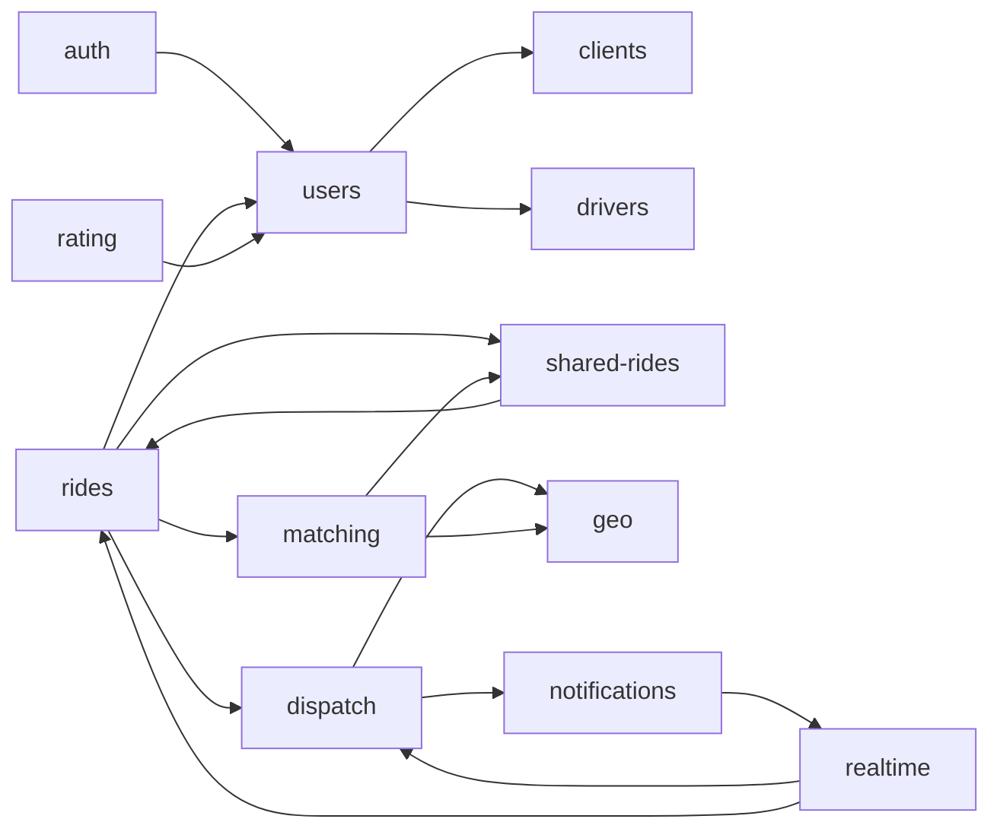

# Service boundaries

*Phase-0 ships one Node process. The internal seams are drawn so we can split later without rewrites.*

## Modules (logical services)

## Dependency rule

A module may depend on modules **below it** in the diagram (toward leaves) but never above. `geo`, `realtime`, `notif` are leaf-ish primitives shared by many. If `auth` ever needs to call `rides`, that's a smell — push the data the other way through `users`.

## Public vs. internal

- Every module exposes a **NestJS provider class** as its public surface.
- Cross-module calls go through providers, never through repositories or DB models directly.
- This is the seam along which we will later split into separate Node processes if needed.

## What about cyclic temptations?

- `shared` and `rides` look like a cycle. They aren't: `shared` owns the *pool concept*; `rides` owns the *ride record*. `shared.commit()` returns a ride DTO; `rides` does not import `shared`.
- `realtime` is the only place that consumes WebSocket events. Modules emit via a `RealtimeBus` provider; they don't import the gateway.

## Future splits (Phase-1 hints)

- `dispatch + matching + shared + geo` → "dispatch service" (own Node process, talks Redis directly).
- `realtime` → its own node, behind a separate WS subdomain.
- `auth` → can be split out and put behind a stricter network policy.

## See also
- [[module-map]] · [[nestjs-structure]] · [[c4-containers]]
- [[scaling-strategy]]
