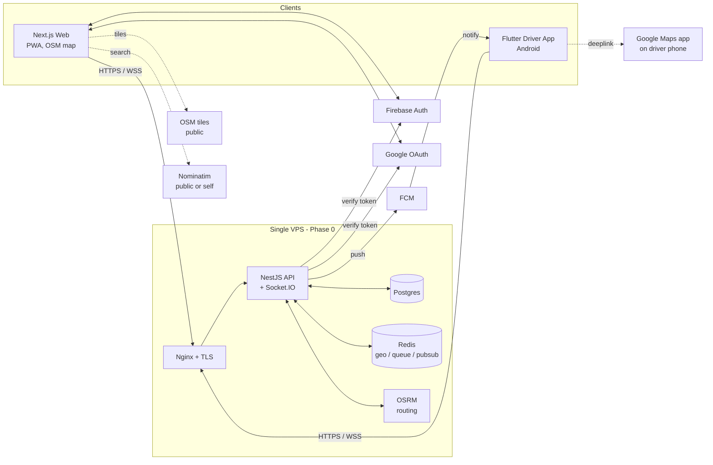

# System overview

*One screen, end to end.* This is the note new contributors load first after [[HOME]].

## Components, in one paragraph

A **Next.js web app** serves clients on mobile browsers (PWA). A **Flutter Android app** serves drivers. Both speak to a **single NestJS HTTP + Socket.IO server** running on one VPS. The server persists transactional state in **Postgres**, holds ephemeral state (driver geo index, dispatch offers, scheduled-job queue, session counters) in **Redis**, and emits realtime events over **Socket.IO**. Auth is delegated to **Firebase Phone Auth**; subsequent logins can use **Google Sign-In** once a user links it. Pick/drop UI for clients uses **OpenStreetMap** tiles, **Nominatim** for geocoding, and a self-hosted **OSRM** instance for route + ETA. Driver turn-by-turn navigation is handed off to **Google Maps via deep link**. Push notifications for drivers go through **FCM**.

## Picture

## Why one server?

Phase-0 is 5,000 users / 100 drivers, sustainable on a 4-vCPU VPS. Modularity is enforced at the **NestJS module level**, not by deploying microservices. See [[service-boundaries]]. Splitting comes in Phase-1 — see [[scaling-strategy]].

## What is NOT here (and why)

- No event bus (Kafka/RabbitMQ). Redis pub/sub is enough for now.
- No managed Postgres. Self-hosted container with WAL backups — see [[backups]].
- No CDN. Nginx serves the Next.js build directly. We may put Cloudflare in front later.
- No payments service. Cash-on-completion in Phase-0.

## See also
- [[c4-context]] · [[c4-containers]]
- [[tech-stack]] · [[deployment-topology]] · [[service-boundaries]] · [[scaling-strategy]]
- [[module-map]]
