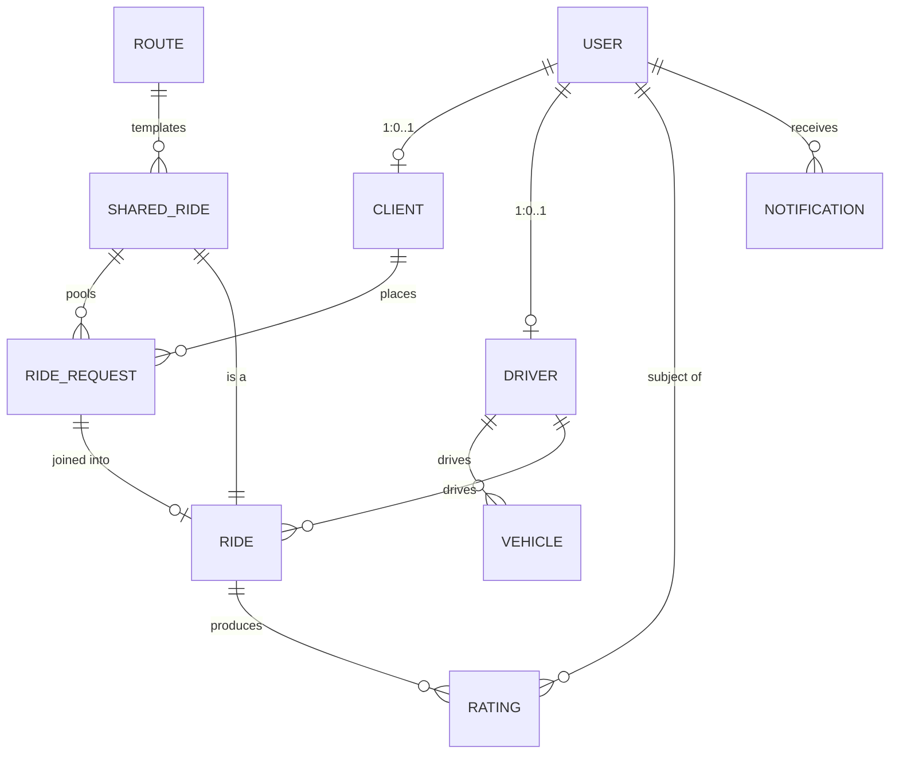

# Data model

*ER overview. Each entity has its own note for fields, invariants, lifecycle.*

## Conceptual notes

- **User is the auth-level entity.** A user has *either* a `Client` profile *or* a `Driver` profile (Phase-0: exclusive; Phase-1 may allow both).
- **Ride vs. RideRequest.** A `RideRequest` is what the client placed; a `Ride` is what the driver is actually doing. For solo rides they are 1:1. For shared rides, one `Ride` (which is a `SharedRide`) holds multiple `RideRequest`s.
- **Route is emergent.** We do not pre-define routes. A `Route` row is created when matching detects a meaningful corridor and persists it for future similarity checks. See [[algo-route-similarity]].
- **Rating is per-ride per-direction.** Each completed ride yields up to N+1 ratings (driver rates each passenger; each passenger rates the driver).

## Identifiers

- All IDs are **UUID v7** (time-sortable). Generated client-side in some flows for idempotency (e.g., ride request creation).
- All timestamps are `timestamptz` in UTC. Frontends do tz conversion.

## See also
- Entity notes (all in `30-domain/entities/`):
  [[entity-user]] · [[entity-client]] · [[entity-driver]] · [[entity-vehicle]] · [[entity-ride]] · [[entity-ride-request]] · [[entity-shared-ride]] · [[entity-route]] · [[entity-location]] · [[entity-rating]] · [[entity-notification]]
- [[schema-postgres]] · [[migrations]]
