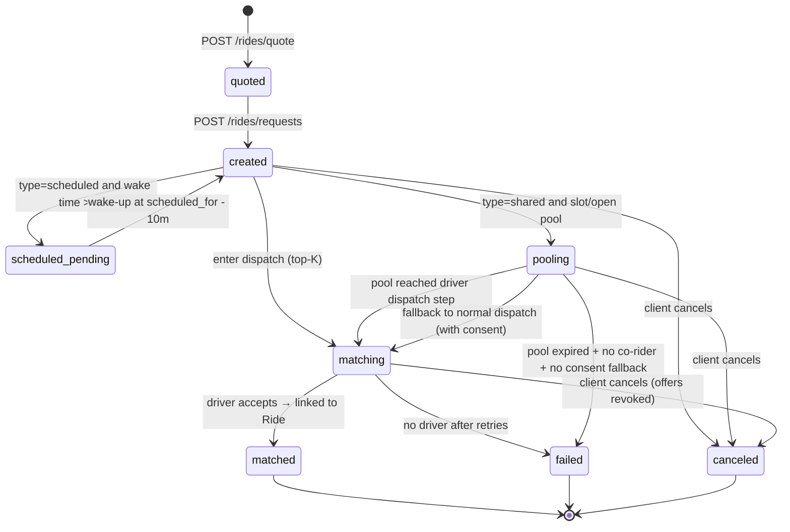

# Booking flow

*A [[entity-ride-request]] from `created` to terminal.*

## Notes

- `quoted` is not persisted. It is the OSRM-routed estimate the API returned and the client retained.
- `scheduled_pending` rides are persisted but parked. They are kicked back to `created` by the BullMQ job at `scheduled_for - 10m`.
- Cancellation transitions are valid until `matched`. After `matched`, cancellation moves to the [[sm-ride-lifecycle]].

## See also
- [[entity-ride-request]] · [[sm-ride-lifecycle]] · [[sm-shared-ride-pool]]
- [[algo-top-k-dispatch]] · [[module-dispatch]]
