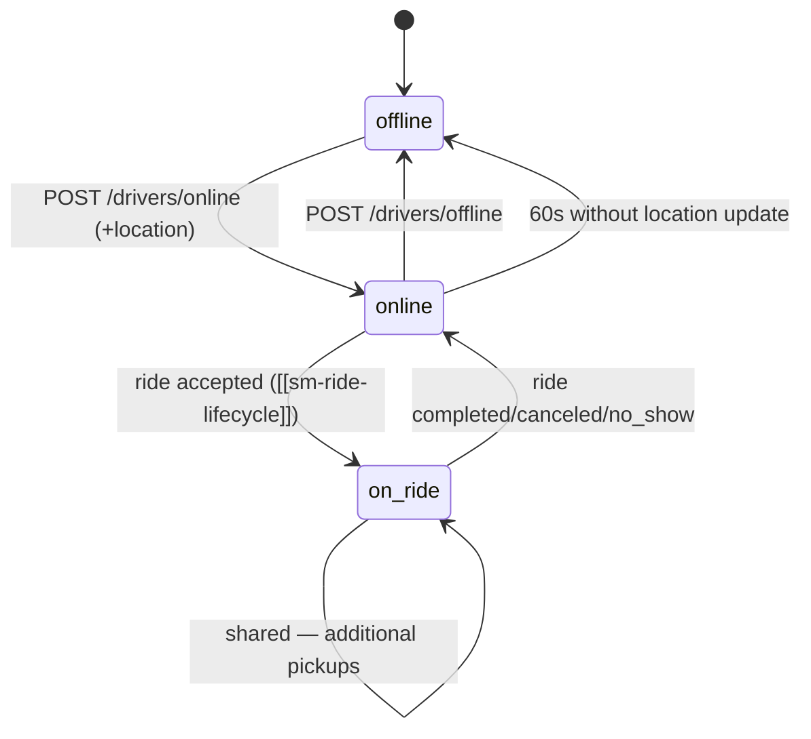

# Driver availability

*The states a driver flows through while operating.*

## Where the state lives

- **Postgres** `driver.availability` — denormalized, eventually consistent (for dashboards).
- **Redis** `driver:state:<driver_id>` — authoritative for dispatch eligibility.
- **Redis** `active_drivers` GEO set — only contains drivers whose Redis state is `online`.

Dispatch reads only Redis; Postgres is for analytics.

## Why drop the geo entry the moment a driver goes `on_ride`?

Dispatch should never see a busy driver. The `on_ride` driver continues to send location updates, but those go to the **ride's** location stream (for tracking), not to the dispatch pool.

## Reconnect handling

If the driver app reconnects after a brief dropout (network glitch), Redis state is restored from the WS handshake (`driver_id` + last known position). If state was `on_ride` before the drop, the app rejoins the ride channel.

## See also
- [[entity-driver]] · [[redis-usage]]
- [[journey-driver-go-online]] · [[module-realtime]] · [[module-dispatch]]
