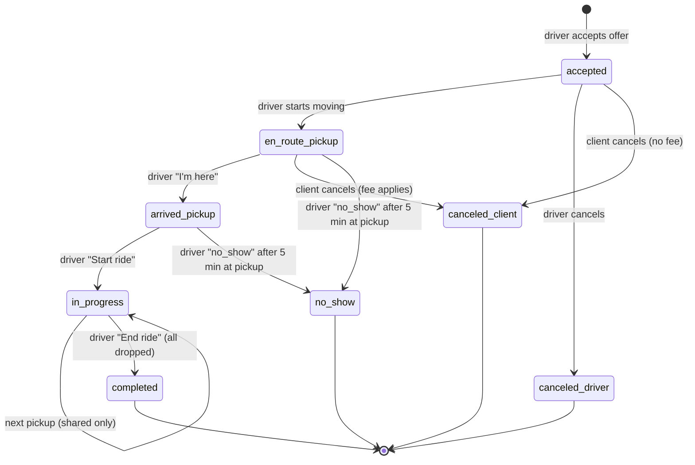

# Ride lifecycle

*From acceptance to completion or cancellation.*

## Transition rules

| From | Event | To | Notes |
|---|---|---|---|
| `accepted` | `start_en_route` | `en_route_pickup` | implicit on first location update after accept |
| `en_route_pickup` | `mark_arrived` | `arrived_pickup` | within 50m of pickup |
| `arrived_pickup` | `start_ride` | `in_progress` | requires client present (driver attests) |
| `in_progress` | `next_pickup` (shared) | `in_progress` | recompute route via OSRM |
| `in_progress` | `end_ride` | `completed` | all requests delivered |
| any pre-`completed` | `cancel_driver` | `canceled_driver` | reason required |
| any pre-`in_progress` | `cancel_client` | `canceled_client` | fee depends on transition point |
| `en_route_pickup`/`arrived_pickup` | `mark_no_show` | `no_show` | 5-minute wait after arrival |

## Implementation note

State transitions go through a single `RideStateMachine.apply(rideId, driverId, event)` service in [[module-rides]]. The service:

1. SELECTs the current row `FOR UPDATE` inside a transaction.
2. Validates the transition.
3. Writes the new state + audit row.
4. Emits a domain event on `RealtimeBus` ([[module-realtime]]).

This eliminates "what if two updates race" classes of bugs.

## As-built — solo (RCAB-E4.S6)

The solo `rides` table uses the state strings **`en_route`** / **`arrived`** (no `_pickup` suffix — that suffix is a shared multi-stop concept; a solo ride has one pickup and one drop). The forward machine is `RideStateMachine.apply(rideId, driverId, event)` in [[module-rides]], with events `start_en_route` → `mark_arrived` → `start_ride` → `end_ride`. It is driven by the driver over REST (`POST /v1/rides/:id/state`, see [[rest-endpoints]]) and broadcasts `ride_state_changed` to room `ride:<id>` after commit (see [[websocket-events]]). `start_en_route` is an explicit "Start trip" button in E4.S6; the "implicit on first location update" trigger lands with the driver location stream in RCAB-E4.S7. Cancellation / `no_show` transitions are RCAB-E4.S8. Shared rides advance instead through per-stop confirms (`RideLifecycleService`, RCAB-E5.S7).

## See also
- [[entity-ride]] · [[sm-booking-flow]] · [[sm-shared-ride-pool]]
- [[module-rides]] · [[module-realtime]]
