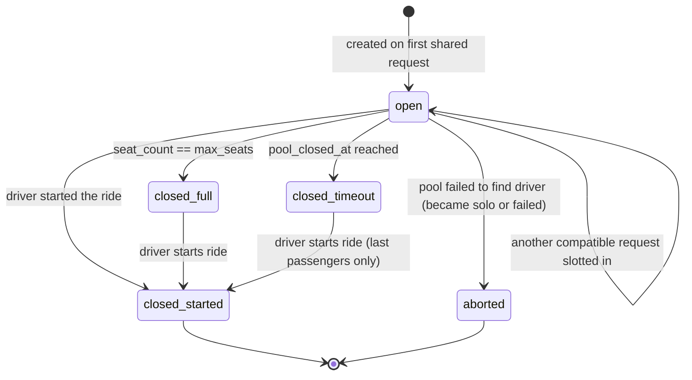

# SharedRide pool

*The life of a [[entity-shared-ride]] from open to closed-to-joins.*

## Notes

- A pool can be `closed_*` (no more joiners) yet **not yet started**, while the driver is en route.
- The state of the *ride itself* once it starts is governed by [[sm-ride-lifecycle]]. The pool state machine ends when the ride begins.

## See also
- [[entity-shared-ride]] · [[features-shared-rides]]
- [[algo-shared-ride-matching]] · [[sm-ride-lifecycle]]
