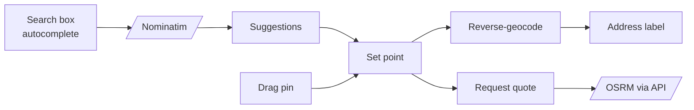

# Web client — OSM integration

*Leaflet for tiles + interactions; Nominatim for autocomplete; OSRM (server-side) for routes.*

## Library choice

- **Leaflet** for Phase-0. Mature, ~40 KB gz, plays nicely with React via `react-leaflet`. Good enough on low-end Android browsers.
- **MapLibre GL** is a Phase-1 upgrade path if vector tiles improve perceived quality. The booking-screen abstraction is built so swap is a contained refactor.

## Tile source

- OSM standard tiles for Phase-0 (with attribution).
- Reasonable per-second policy adherence by debouncing pan/zoom.
- If we cross OSM's recommended ceiling, switch to a Carto-free tile provider with a generous free tier (Stadia, MapTiler) — pluggable via env.

## Pick/drop UX

- Pick first, then drop. The map recenters to the union bounds.
- Polyline drawn from OSRM response.
- **Live tracking (RCAB-E4.S7):** while a solo ride is active the driver's position renders as a distinct filled-circle marker (vs the teardrop endpoint pins), moved in place on each `driver_location` (≤ 1 Hz). The same `MapPicker` is reused via an optional `driver` prop — no separate map component.

## Performance

- Marker icons are inline SVG, not raster.
- Tile prefetch for the predicted route is disabled (cost > benefit at our scale).
- Map mount lazy-imported so non-booking pages don't pay the bundle cost.

## See also
- [[integration-openstreetmap]] · [[integration-nominatim]] · [[integration-osrm]]
- [[web-nextjs-structure]] · [[ADR-0004-osm-for-booking-google-for-nav]]
