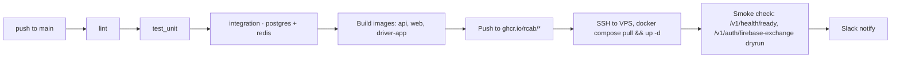

# CI / CD

*GitHub Actions; build → test → deploy on push to `main`.*

## Pipeline

## Jobs

| Job | Notes |
|---|---|
| `lint` | ESLint, Prettier, `tsc --noEmit`, `dart analyze` |
| `test:unit` | Jest, Flutter unit tests |
| `test:integration` | Spins up `postgres` + `redis` services in Actions; runs `pnpm test:int` (Vitest + Testcontainers) against real DBs |
| `test:e2e` | Playwright against a built web image fronted by a local mock API — runs nightly, not blocking on PR |
| `test:load` | k6 against staging — runs nightly |
| `build:api` | Docker image, tagged with commit SHA and `main`-rolling |
| `build:web` | Docker image (multi-stage; final stage = nginx serving `out/`) |
| `build:driver-app` | APK + AAB artifact; uploaded to Play Console internal track |
| `deploy:vps` | SSH key from GitHub OIDC → AWS Secrets, pulls images, restarts services |

## Branch protections

- PR required to merge to `main`.
- All required jobs green.
- One review approval.

## Versioning

- Backend & web: deploy on every `main` push; container tag is the commit SHA.
- Driver app: bumped via `pubspec.yaml`; releases tagged `driver-v<x.y.z>`.

## Secrets in CI

- GitHub Environments `staging` and `prod` with required reviewers on `prod`.
- Secrets injected only into the deploy job; build/test jobs see no secrets.

## See also
- [[docker-compose]] · [[testing-strategy]] · [[migrations]]
- [[secrets-management]]
