# CI / CD

*Dockerized Jenkins running in the prod compose stack; GitHub is a plain git remote.*

## Pipeline

```mermaid
flowchart LR
  push[push / PR] --> jenkins[Jenkins webhook trigger]
  jenkins --> lint
  lint --> test_unit[test:unit]
  test_unit --> test_int[test:int · Testcontainers]
  test_int --> build[Build images: api, web]
  build --> push_reg[Push to ghcr.io/logicthread/rcab/*]
  push_reg --> gate[Manual input gate]
  gate --> deploy[SSH to VPS · docker compose pull && up -d]
  deploy --> smoke[Smoke check: /v1/health/ready]
```

## Stages — `Jenkinsfile`

| Stage | Commands | When |
|---|---|---|
| `Install` | `pnpm install --frozen-lockfile` | all branches |
| `Lint` | `pnpm lint` · `pnpm exec tsc --noEmit` | all branches |
| `Unit tests` | `pnpm test` | all branches |
| `Integration tests` | `pnpm test:int` (Testcontainers spins up postgres + redis internally) | all branches |
| `Build images` | `docker build` for api + web; tagged with commit SHA + `latest` | all branches |
| `Push to GHCR` | `docker push ghcr.io/logicthread/rcab/{api,web}:{sha,latest}` | `main`, `release/**` |
| `Deploy to staging` | `input` gate → SSH → `docker compose pull && up -d` → smoke check | `main`, `release/**` |

Nightly e2e + load tests live in `Jenkinsfile.nightly` with a `cron('H 2 * * *')` trigger.

## Jenkins in docker-compose

Jenkins runs as a service in `docker-compose.prod.yml`, bound to `127.0.0.1:8080`. The Jenkins image (`infra/docker/jenkins/Dockerfile`) bundles Docker CLI + Node 20 + pnpm 10 and mounts the host Docker socket for image builds.

Required Jenkins credentials (configure in Jenkins → Manage Credentials):

| ID | Type | Used for |
|---|---|---|
| `ghcr-pat` | Secret text | `docker login ghcr.io` |
| `vps-host` | Secret text | SSH target hostname/IP |
| `vps-ssh-key` | SSH username + private key | SSH deploy |

## Branch protections (GitHub)

GitHub branch protection on `main` requires:
- PR before merge
- One review approval

CI status checks are enforced by Jenkins directly — the `input` gate on the deploy stage and the pipeline result block merges conceptually. Optional: install the Jenkins GitHub plugin to post commit statuses back to GitHub PRs.

## Versioning

- Backend & web: deploy on every `main` push; container tag is the commit SHA.
- Driver app: bumped via `pubspec.yaml`; releases tagged `driver-v<x.y.z>`.

## See also
- [[docker-compose]] · [[testing-strategy]] · [[migrations]]
- [[secrets-management]]
