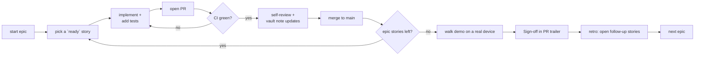

# Demo cadence

*The rhythm between demos. Each demo is a hard stop and a hand-off.*

## Per-demo loop

## Per-story contract

1. **Pick `ready` stories only.** A story is `ready` when its acceptance criteria, test plan, and `affected_notes` are filled in.
2. **Tests come first or alongside** — never after.
3. **Vault updates with code** — if you discover something the vault didn't capture, update the vault in the same PR.
4. **Commit message must carry `Story: RCAB-Ex.Sy`** — see [[commit-story-linkage]].
5. **PR description** lists the story, the acceptance criteria with check marks, the affected vault notes, and any micro-issues observed for future stories.

## Per-demo contract

A demo is a checkpoint, not a deadline:

1. All stories in the epic are `done`.
2. The whole demo runs from a **fresh `docker compose up`** on the developer's machine.
3. Tests for this demo (unit + integration + e2e where applicable) are green in CI.
4. Relevant Grafana panels show real data for the demo's flows.
5. Performance budgets in [[performance-budget]] for this stage are within target.
6. Developer signs off in the merging PR with `Sign-off: <name>` in the trailer.
7. Retro: any micro-issues from the walk-through are filed as new stories (no fixes in the demo PR itself, to keep merges clean).

## What we do NOT do

- We do not skip a demo. If a story slips, we either split it or move it to the next epic; we don't demo a half-done flow.
- We do not start the next epic before the current one is signed off.
- We do not gate demos on calendar time. They're done when they're done.

## Per-epic retro questions

After every demo:

- Which stories took ≥ 2× the estimate, and why? (Estimates are gut-feel — not for scheduling, but pattern-spotting is useful.)
- Any acceptance criteria that we rewrote mid-flight? Run [[impact-analysis]] on the why.
- Any test category (unit / int / e2e / load) we under-invested in? Adjust [[testing-strategy]].

## See also
- [[delivery-roadmap]] · [[hitl-touchpoints]] · [[impact-analysis]]
- [[testing-strategy]] · [[performance-budget]]
